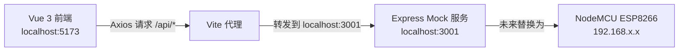
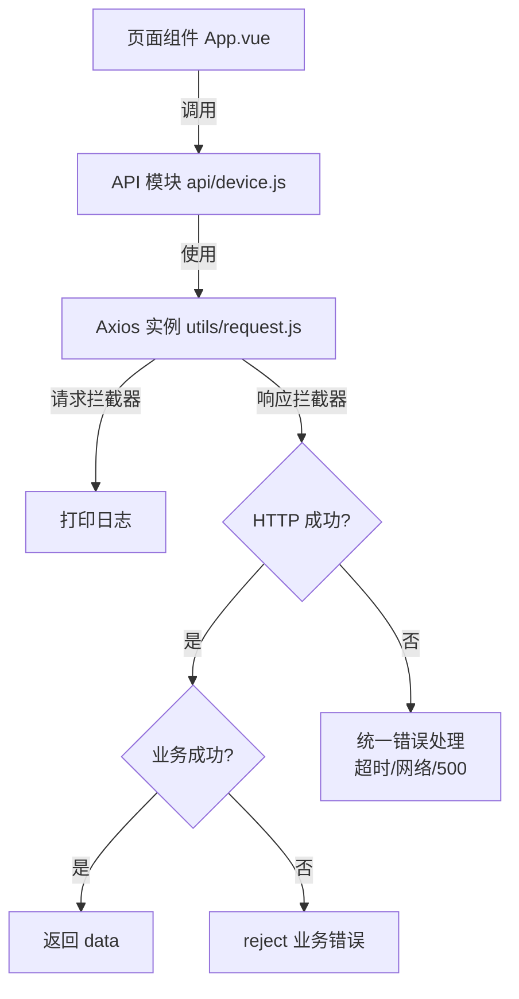

# WiFi 智能灯控制面板 — 完整项目说明

## 一、项目设计说明

### 整体架构



**前端**通过 Axios 发出请求，请求 `/api/status`、`/api/on`、`/api/off` 等路径。Vite 开发服务器的 **proxy 代理**会自动把 `/api` 开头的请求转发到 `localhost:3001` 上的 **Express Mock 服务**，并去掉 `/api` 前缀。未来拿到真实 NodeMCU 时，只需修改 Axios 的 `baseURL` 即可。

### 为什么选 Express 独立 Mock 服务

| 方案 | 优点 | 缺点 | 适用场景 |
|------|------|------|----------|
| **Express（✅ 选用）** | 最灵活、可模拟延迟/失败/状态变化、初学者易懂 | 需要额外启动一个进程 | 需要有状态的接口模拟 |
| vite-plugin-mock | 集成度高 | 插件版本兼容性问题多，不够灵活 | 简单静态 mock |
| json-server | 开箱即用 | 只能做 REST CRUD，无法模拟状态切换 | 传统增删改查 |
| msw | 标准化好 | 学习成本高，配置复杂 | 大型项目测试 |

**核心理由**：你的 NodeMCU 是"有状态的"（灯开了就一直开着），Express 可以用内存变量模拟这种状态，而且代码直白、初学者一看就懂。

### Axios 封装设计



---

## 二、最终目录结构

```
WifiLight/
├── index.html                  # 入口 HTML
├── package.json                # 项目依赖与脚本
├── vite.config.js              # Vite 配置（含代理）
├── mock/
│   └── server.js               # Express Mock 服务器
└── src/
    ├── main.js                 # 应用入口
    ├── App.vue                 # 根组件（组装页面）
    ├── api/
    │   └── device.js           # API 封装（设备接口）
    ├── composables/
    │   ├── useDevice.js        # 设备状态管理
    │   └── useToast.js         # Toast 消息管理
    ├── components/
    │   ├── AppHeader.vue       # 页面标题
    │   ├── StatusCards.vue     # 设备/灯状态卡片
    │   ├── ControlButton.vue   # 核心控制大按钮
    │   ├── InfoPanel.vue       # 信息面板 + 刷新
    │   ├── LoadingOverlay.vue  # 全屏加载遮罩
    │   └── ToastMessage.vue    # Toast 消息提示
    └── styles/
        └── global.css          # 全局样式与设计令牌
```

---

## 三、界面展示

### 灯光关闭状态（默认）


### 灯光开启状态


### 设备离线状态


---

## 四、接口设计

所有接口返回统一的 JSON 格式：

```json
{
  "success": true/false,
  "message": "操作结果描述（可选）",
  "data": {
    "deviceOnline": true/false,
    "lightOn": true/false,
    "updatedAt": "2026-04-10 17:30:00"
  }
}
```

| 接口 | 方法 | 说明 | 返回示例 |
|------|------|------|----------|
| `/status` | GET | 获取设备状态 | `{ success: true, data: { deviceOnline: true, lightOn: false, updatedAt: "..." } }` |
| `/on` | GET | 打开灯 | `{ success: true, message: "灯已打开", data: { lightOn: true, updatedAt: "..." } }` |
| `/off` | GET | 关闭灯 | `{ success: true, message: "灯已关闭", data: { lightOn: false, updatedAt: "..." } }` |

### Mock 调试接口（仅开发用）

| 接口 | 说明 |
|------|------|
| `/mock/set-offline` | 模拟设备离线 |
| `/mock/set-online` | 模拟设备上线 |
| `/mock/set-fail` | 开启失败模拟（HTTP 500） |
| `/mock/set-normal` | 关闭失败模拟 |

---

## 五、如何运行项目

### 从零开始

```bash
# 进入项目目录
cd d:\WifiLight

# 安装依赖（只需运行一次）
npm install

# 同时启动 Mock 服务和前端（推荐）
npm run start

# 或者分别启动：
# 终端 1：启动 Mock 服务
npm run mock

# 终端 2：启动前端
npm run dev
```

### 访问地址

- **前端页面**：http://localhost:5173/
- **Mock 服务**：http://localhost:3001/

---

## 六、交互说明

### 页面加载时
1. 显示全屏 Loading 遮罩，文字"正在连接设备..."
2. 自动请求 `GET /api/status` 获取设备状态
3. 成功 → 渲染状态卡片，显示绿色 Toast "设备连接成功"
4. 失败 → 显示红色 Toast "连接设备失败，请检查网络后点击刷新"

### 点击中央大按钮时
1. 检查当前灯状态
2. 灯关 → 请求 `GET /api/on`；灯开 → 请求 `GET /api/off`
3. 按钮显示 Loading 旋转环，文字变为"执行中..."
4. 按钮禁用，防止重复点击
5. 成功 → 更新状态 + 显示成功 Toast "灯已打开/灯已关闭"
6. 失败 → 显示失败 Toast

### 点击"刷新状态"时
1. 请求 `GET /api/status`
2. 刷新图标旋转，按钮禁用
3. 成功 → 更新所有状态显示
4. 失败 → 显示错误提示

### 设备离线时
- 设备状态卡片显示红色"离线"，红色圆点
- 控制按钮半透明，显示"设备离线"
- 按钮下方红色提示"设备离线，无法操作"
- 按钮不可点击

---

## 七、如何测试

### 正常功能测试
1. 启动项目后打开 http://localhost:5173/
2. 点击大按钮开灯 → 灯泡变金色，状态卡片变"已开启"
3. 再次点击关灯 → 灯泡变灰色，状态卡片变"已关闭"
4. 点击"刷新状态" → 最后更新时间刷新

### 模拟设备离线
在浏览器地址栏直接访问：
```
http://localhost:3001/mock/set-offline
```
然后回到控制面板点击刷新，观察离线表现。恢复：
```
http://localhost:3001/mock/set-online
```

### 模拟服务器错误
```
http://localhost:3001/mock/set-fail
```
然后操作按钮或刷新，观察错误提示。恢复：
```
http://localhost:3001/mock/set-normal
```

### 验证 Axios 封装
打开浏览器开发者工具（F12）→ Console 面板，每次请求都会打印：
```
[请求] GET /api/status
[响应] /status { success: true, data: { ... } }
```

---

## 八、如何切换到真实 NodeMCU

当你拿到 NodeMCU + 继电器 + USB 灯后，只需要做 **两处修改**：

### 1. 修改 Axios 的 baseURL

打开 [request.js](file:///d:/WifiLight/src/utils/request.js)，修改第 21 行：

```diff
- baseURL: '/api',
+ baseURL: 'http://192.168.1.100',  // 替换为你的 NodeMCU IP
```

### 2. 停止 Mock 服务

不再需要运行 `npm run mock`，直接运行 `npm run dev` 即可。

> [!IMPORTANT]
> **局域网注意事项**：
> - NodeMCU 和你的电脑/手机必须在同一个 WiFi 局域网下
> - NodeMCU 的 IP 地址可以在路由器管理页面查看，或在 Arduino IDE 的串口监视器中看到
> - 如果浏览器报 CORS 错误，需要在 NodeMCU 的代码中添加 `Access-Control-Allow-Origin: *` 响应头

---

## 九、Mock 服务详细解释

> [!NOTE]
> **给初学者的解释**：你可以把 Mock 想象成一个"演员"，它假装自己是 NodeMCU 设备。前端对它说"开灯"，它就回复"好的，灯已打开"。这样你不需要真实硬件就能开发和测试前端界面。

### 请求链路图解

```
你的浏览器                    Vite 开发服务器              Express Mock
   │                              │                          │
   │──GET /api/status──────────►  │                          │
   │                              │──GET /status──────────► │
   │                              │                          │── 查询内存中的设备状态
   │                              │  ◄──JSON 响应────────── │
   │  ◄──JSON 响应─────────────  │                          │
   │                              │                          │
```

### Mock 服务的内存状态

```javascript
// mock/server.js 中的这个对象就是"模拟设备"
const deviceState = {
  deviceOnline: true,   // 设备是否在线
  lightOn: false,       // 灯是否亮着
  updatedAt: '...'      // 上次操作时间
}
```

每次前端请求 `/on` 或 `/off`，Mock 就修改这个对象。就像真实 NodeMCU 控制继电器开关一样。

---

## 十、可选优化建议

| 优化项 | 描述 | 难度 |
|--------|------|------|
| 自动轮询 | 每 5 秒自动请求 `/status` 更新设备状态 | ⭐ |
| 操作日志 | 记录每次操作的时间和结果，显示在页面底部 | ⭐⭐ |
| 主题切换 | 亮色/暗色主题切换 | ⭐⭐ |
| PWA 支持 | 添加 manifest 和 service worker，可安装到手机桌面 | ⭐⭐ |
| 多设备支持 | 支持控制多个灯/设备 | ⭐⭐⭐ |
| 定时任务 | 设定自动开关灯时间 | ⭐⭐⭐ |
| WebSocket | 替代轮询，实现实时状态推送 | ⭐⭐⭐ |

---

## 十一、关键文件说明

| 文件 | 职责 |
|------|------|
| [vite.config.js](file:///d:/WifiLight/vite.config.js) | Vite 配置，包含代理规则 |
| [mock/server.js](file:///d:/WifiLight/mock/server.js) | Mock 服务器，模拟 NodeMCU |
| [src/utils/request.js](file:///d:/WifiLight/src/utils/request.js) | Axios 实例，统一拦截器和错误处理 |
| [src/api/device.js](file:///d:/WifiLight/src/api/device.js) | API 封装，3 个接口函数 |
| [src/composables/useDevice.js](file:///d:/WifiLight/src/composables/useDevice.js) | 设备状态管理逻辑 |
| [src/composables/useToast.js](file:///d:/WifiLight/src/composables/useToast.js) | Toast 消息管理 |
| [src/App.vue](file:///d:/WifiLight/src/App.vue) | 根组件，组装所有子组件 |
| [src/components/ControlButton.vue](file:///d:/WifiLight/src/components/ControlButton.vue) | 核心大按钮，灯泡 SVG + 动画 |
| [src/styles/global.css](file:///d:/WifiLight/src/styles/global.css) | 全局样式，设计令牌 |
